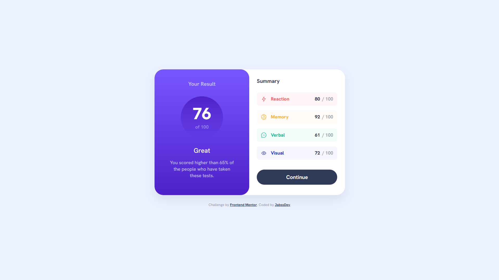

# Frontend Mentor - Results summary component solution

This is a solution to the [Results summary component challenge on Frontend Mentor](https://www.frontendmentor.io/challenges/results-summary-component-CE_K6s0maV). Frontend Mentor challenges help you improve your coding skills by building realistic projects.

## Table of contents

- [Overview](#overview)
  - [The challenge](#the-challenge)
  - [Screenshot](#screenshot)
  - [Links](#links)
- [My process](#my-process)
  - [Built with](#built-with)
  - [What I learned](#what-i-learned)
  - [Continued development](#continued-development)
  - [Useful resources](#useful-resources)
- [Author](#author)

## Overview

### The challenge

Users should be able to:

- View the optimal layout for the interface depending on their device's screen size
- See hover and focus states for all interactive elements on the page
- **Bonus**: Use the local JSON data to dynamically populate the content

### Screenshot



### Links

- Solution URL: [GitHub Repository](https://github.com/jabssdev/results-summary-component)
- Live Site URL: [Live Demo](https://results-summary-component-jabssdev.netlify.app/)

## My process

### Built with

- Semantic HTML5 markup
- CSS custom properties (CSS variables)
- Flexbox
- BEM methodology for CSS naming
- Modern CSS logical properties
- Mobile-first workflow
- Vanilla JavaScript (ES6+)
- Webpack 5 - Module bundler
- html-loader - For processing HTML templates
- MiniCssExtractPlugin - For CSS extraction
- CopyWebpackPlugin - For copying static assets
- Webpack Dev Server - For local development

### What I learned

Through this project, I strengthened my understanding of several key concepts:

**1. Dynamic Data Population with JSON**

I implemented a JavaScript solution to dynamically load and render data from a JSON file, calculating the average score automatically:

```js
function loadSummaryData() {
	const summaryList = document.querySelector(".summary-card__list");
	summaryList.innerHTML = "";

	data.forEach((item) => {
		const categoryClass = item.category.toLowerCase();
		const listItem = `
      <li class="summary-card__item summary-card__item--${categoryClass}">
        <div class="summary-card__item--icon">
          
          <span class="summary-card__item--title">${item.category}</span>
        </div>
        <div class="summary-card__item--info">
          <span><strong>${item.score}</strong> / 100</span>
        </div>
      </li>
    `;
		summaryList.insertAdjacentHTML("beforeend", listItem);
	});

	const averageScore = Math.round(data.reduce((acc, item) => acc + item.score, 0) / data.length);
	document.querySelector(".result-card__score--number").textContent = averageScore;
}
```

**2. Two-Column Layout with Flexbox**

Creating a responsive layout where both cards have equal width and stretch to full height:

```css
main {
	display: flex;
	flex-direction: row;
	max-width: 65rem;
	overflow: hidden;
	border-radius: 3rem;
}

.result-card,
.summary-card {
	flex: 1; /* Both cards take equal space */
	width: auto;
}
```

**3. CSS Logical Properties for Better Internationalization**

Using logical properties instead of physical ones for better RTL support:

```css
.result-card {
	border-end-start-radius: 3.6rem;
	border-end-end-radius: 3.6rem;
}

.result-card__title {
	margin-block-end: 2.4rem;
}

.summary-card__item--info strong {
	margin-inline-end: 0.3rem;
}
```

**4. BEM Naming Convention for Scalable CSS**

Maintaining a consistent and maintainable CSS architecture:

```css
.summary-card__item--icon {
	display: flex;
	align-items: center;
	gap: 1.4rem;
}

.summary-card__item--reaction {
	background-color: var(--clr-light-red-bg);
	color: var(--clr-light-red);
}
```

**5. Webpack Configuration for Asset Management**

Setting up Webpack to handle multiple asset types and optimize for production:

```js
module: {
  rules: [
    {
      test: /\.html$/,
      use: 'html-loader',
    },
    {
      test: /\.css$/,
      use: [isProduction ? miniCssExtractPlugin.loader : 'style-loader', 'css-loader'],
    },
  ],
},
plugins: [
  new CopyPlugin({
    patterns: [
      { from: 'src/data.json', to: 'data.json' },
      { from: 'src/assets', to: 'assets' },
    ],
  }),
]
```

**6. Accessibility Best Practices**

Implementing proper ARIA labels and semantic HTML:

```html
<h1 class="visually-hidden">Results Summary</h1>

<button class="summary-card__button" type="button" aria-label="Continue to the next step">Continue</button>
```

### Continued development

In future projects, I want to continue focusing on:

- **Advanced Webpack Optimization**: Exploring code splitting, tree shaking, and lazy loading techniques for better performance
- **CSS Architecture**: Deepening understanding of CSS Modules and other component-scoped styling approaches
- **JavaScript Patterns**: Implementing more advanced design patterns like Module Pattern and Observer Pattern
- **Accessibility Testing**: Using automated tools like axe DevTools and manual testing with screen readers
- **TypeScript**: Adding type safety to JavaScript projects for better code maintainability
- **CSS Grid**: Exploring more complex grid layouts for multi-dimensional designs
- **Progressive Enhancement**: Building experiences that work without JavaScript but enhance with it
- **Performance Metrics**: Measuring and optimizing Core Web Vitals (LCP, FID, CLS)

### Useful resources

- [Webpack Documentation](https://webpack.js.org/concepts/) - Essential for understanding module bundling, loaders, and plugins configuration.
- [CSS-Tricks: A Complete Guide to Flexbox](https://css-tricks.com/snippets/css/a-guide-to-flexbox/) - Helped me understand how to create equal-height columns with Flexbox.
- [MDN Web Docs: CSS Logical Properties](https://developer.mozilla.org/en-US/docs/Web/CSS/CSS_Logical_Properties) - Comprehensive guide on using logical properties for better internationalization.
- [BEM Methodology](https://getbem.com/) - Clear explanation of BEM naming convention for maintainable CSS architecture.
- [MDN Web Docs: Array.reduce()](https://developer.mozilla.org/en-US/docs/Web/JavaScript/Reference/Global_Objects/Array/reduce) - Helped me calculate the average score from the data array.
- [MDN Web Docs: insertAdjacentHTML](https://developer.mozilla.org/en-US/docs/Web/API/Element/insertAdjacentHTML) - Better alternative to innerHTML for dynamically adding HTML content.
- [web.dev: ARIA Labels](https://web.dev/labels-and-text-alternatives/) - Best practices for labeling interactive elements for screen readers.
- [Webpack CopyPlugin](https://webpack.js.org/plugins/copy-webpack-plugin/) - Documentation for copying static assets during build process.

## Author

- LinkedIn - [@jabssdev](https://www.linkedin.com/in/jabssdev/)
- Frontend Mentor - [@jabssdev](https://www.frontendmentor.io/profile/jabssdev)
- Instagram - [@jabssdev](https://www.instagram.com/jabssdev/)
